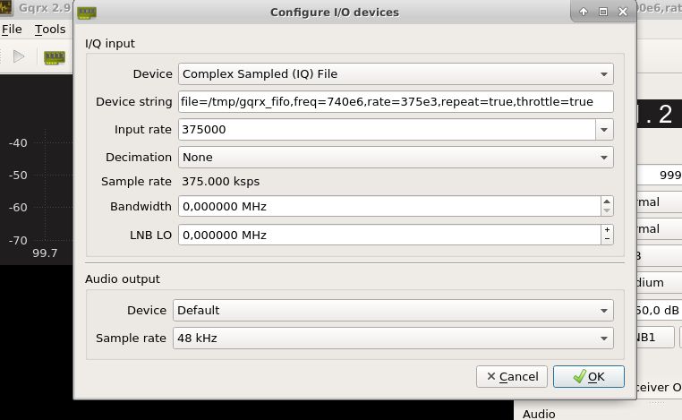

# eshailsat2
#### Scripts and flowgraphs for the Es'hailsat-2 amateur transponder

Included are:

##### beacongen.py
A Python script for generating wav files containing a CW beacon, specified by an input string. Basic pulseshaping is used to remove key clicks.

##### beacontrack.grc
A GNU Radio flowgraph for receiving the QO-100 / Es'hailsat-2 narrowband amateur transponder and performing phaselocking to the PSK400 beacon for automatic LNB drift correction

##### beacontrack_gqrx_airspy.grc
GNU radio flow, allowing to combine drift correction with convenience of GQRX as SDR receiver. It has been tested with Airspy Mini running at 3 MSPS with 8x decimation (375ksps output).

###### Usage:
1. Create new fifo object - execute `mkfifo /tmp/gqrx_fifo` command in linux terminal.
2. Start `gnuradio-companion`, open `beacontrack_gqrx.grc` flow and run it using "Play" button or **F6** key.
3. Start GQRX and select `Complex Sampled (IQ) File` as input device. Provide the following settings: 
4. Start reception in GQRX using "Play" button or `ctrl-D`.
5. You should see both gqrx and grc workflow running.

##### beacontrack_gqrx_rtlsdr.grc
Input osmocom block is using `rtl=0` as input string. Sample rate is 1.5M with 4x decimation. Use `Frequency adjustment` slider to move upper beacon about 110 kHz above center frequency. Rest of instructions - same as above.

##### eshailuplinkgen.grc
A GNU Radio flowgraph for generating an USB signal at 2.4 GHz for uplinking to the QO-100 / Es'hailsat-2 narrowband amateur transponder. Uses Controlled Envelope SSB blocks from https://github.com/drmpeg/gr-cessb
